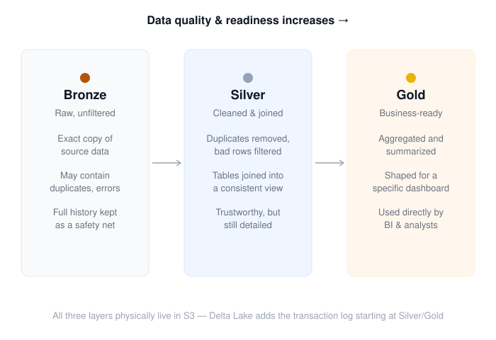

# Lakehouse Concepts: Data Lake, Delta Lake & Medallion Architecture

A quick primer on the terms used throughout this project, for anyone new
to the lakehouse pattern.

## Data Lake

Think of a data lake as a **giant warehouse where you dump raw stuff
as-is** — files, folders, whatever format they come in. No structure
enforced, no rules checked. It's cheap and flexible, but that flexibility
is also the problem: nothing stops two processes from writing at the same
time and corrupting things, and nothing guarantees the data actually
matches the schema you expect.

In this project, **Amazon S3** plays this role.

## Delta Lake

Delta Lake solves the data lake's reliability problem. It's not a
separate storage system — it's a **format/layer that sits on top of the
same files** in S3. Alongside the Parquet files, Delta keeps a
**transaction log** (a running history of every change). That log is
what gives you:

- **ACID transactions** — a write either fully succeeds or fully fails,
  never a half-finished corrupted state
- **Schema enforcement** — you can't accidentally write a table with the
  wrong columns
- **Time travel** — you can query what a table looked like yesterday, or
  roll back a bad write

Think of the transaction log like a **receipt tape for a cash
register**: the actual cash (your data files) sits in the drawer, but
the tape tells you exactly what happened and in what order, so you can
always reconcile things.

## Lakehouse

**Lakehouse = Data lake + Delta Lake guarantees.** It's the combination
of cheap, flexible storage (the lake) with the reliability and structure
of a database (Delta) layered on top. In this project, **Databricks** is
the engine that reads and writes Delta tables, giving S3 those
database-like guarantees.

## Medallion Architecture

This is a **naming convention for progressively cleaning data** as it
moves through the pipeline — like refining crude oil into gasoline.
Three checkpoints:

- **Bronze** — raw, unfiltered, exactly as it came from the source
  (RDS). Messy but complete; a safety net you can always go back to.
- **Silver** — cleaned up: duplicates removed, bad rows filtered, tables
  joined together. Still detailed, but trustworthy.
- **Gold** — business-ready: aggregated, summarized, shaped exactly for
  a dashboard or report. This is what BI tools and analysts actually
  query.

## Quick Reference

| Term | What it actually is |
|---|---|
| **Data lake** | Cheap storage for raw files, no rules enforced (S3) |
| **Delta Lake** | A format that adds a transaction log on top of those files, giving database-like reliability |
| **Lakehouse** | The result of combining the two — a data lake with Delta Lake's guarantees |
| **Medallion architecture** | The bronze → silver → gold naming convention for how data gets progressively refined as it moves through the lakehouse |

> All three medallion layers physically live in S3 — Delta Lake's
> transaction log is what gets added starting at the Silver stage. See
> [`PROJECT_OVERVIEW.md`](./PROJECT_OVERVIEW.md) for how this maps to
> the actual pipeline.
