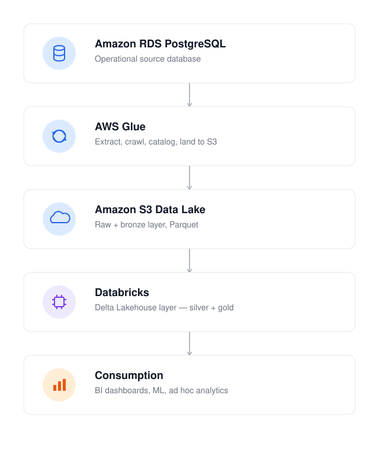

# GreatRx — Medallion Architecture Project Overview

## Summary

This project implements a data lakehouse pipeline that moves operational data
from Amazon RDS (PostgreSQL) into a governed, analytics-ready lakehouse using
AWS Glue, Amazon S3, and Databricks. The pipeline follows the medallion
architecture pattern (raw/bronze → silver → gold): raw/bronze data lands as
plain Parquet in S3, and Databricks converts it into **Delta Lake** tables —
with ACID transactions, schema enforcement, and time travel — as it builds
the silver and gold layers. Data is served to BI, ad hoc analytics, and ML
consumers from the gold Delta tables.

## Architecture

## Pipeline Stages

### 1. Amazon RDS PostgreSQL — Source
The operational, transactional database backing the application. This
remains the system of record; the pipeline reads from it but does not
write back.

### 2. AWS Glue — Extraction & Cataloging
A Glue crawler / ETL job connects to RDS via JDBC, extracts tables, and
writes them to S3 as Parquet. Glue also registers schemas in the **Glue
Data Catalog** so downstream tools (including Databricks) can discover
tables without duplicating schema definitions.

- Use **Glue bookmarks** or a watermark column (e.g. `updated_at`) for
  incremental loads instead of full re-extracts on every run.
- For true change-data-capture, consider **AWS DMS** in front of Glue.

### 3. Amazon S3 — Data Lake Storage
Object storage holding the **raw** (unmodified copies) and **bronze**
(lightly cleaned, partitioned) layers as plain Parquet files. This is the
"data lake" part of the architecture — cheap, durable storage with no
transactional guarantees yet. Decoupling storage from compute is the core
principle that makes the lakehouse pattern cost-effective and flexible.

### 4. Databricks — Transformation & Lakehouse Layer
Databricks reads bronze data from S3 (via the Glue Catalog or Unity
Catalog) and runs Spark jobs to build:

- **Silver**: deduplicated, joined, business-logic-applied tables
- **Gold**: aggregated, analytics-ready tables

This is where the **lakehouse** part comes in: silver and gold tables are
written as **Delta Lake** tables — still physically stored in S3, but now
with a transaction log that provides ACID transactions, schema
enforcement, and time travel.

### 5. Consumption
BI tools (Tableau, Power BI, Databricks SQL dashboards), notebooks, and ML
pipelines read directly from gold Delta tables.

## Design Notes

| Topic | Recommendation |
|---|---|
| Incremental loads | Glue bookmarks or watermark columns; avoid full re-extracts |
| Catalog | Decide early: Glue Data Catalog vs. Databricks Unity Catalog as source of truth |
| Orchestration | Glue Workflows, Databricks Workflows, or an external orchestrator (Airflow, Step Functions) |
| Alternative ingestion | For small workloads, consider Databricks reading directly from RDS via JDBC, or a dedicated CDC tool, to avoid Glue's Spark cold-start latency |

## New to lakehouse concepts?

See [`LAKEHOUSE_CONCEPTS.md`](./LAKEHOUSE_CONCEPTS.md) for a beginner-friendly
explanation of data lakes, Delta Lake, and the medallion architecture used
in this pipeline.

## Status

_Add current build status, environments, and links to relevant Glue jobs /
Databricks workspaces here._
